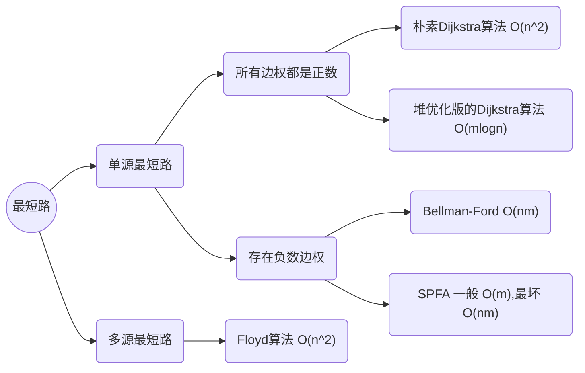

# 搜索与图论总结（2）

### ——思路比模拟更重要

## 最短路

>最短路算法只考虑有向图，无向图作为一种特殊的有向图考虑。
>
>最短路算法可分为：



### Dijkstra


#### 朴素版本

> 朴素版dijkstra适合稠密图、
>
> 时间复杂度 $ O(nm) $
>
> 
>
> 首先初始化各点到源点的距离dist[N]为正无穷，规定源点到源点的距离st[1]=0；初始化除源点外所有点未确定
>
> 找未确定的点中dist最小的点，并把该点确定在，用该点的dist值更新其他未确定点的dist值
>
> ```c++
> for(int j=1;j<=n;j++) dist[j]=min(dist[j],dist[t]+g[t][j]);
> ```
>
> 由于g数组初始化为正无穷所以不会出现没有与t直连的点被赋dist[t]的情况。
>
>
> 用该方法每次可以确定一个点，由于有n个点，那么就需要遍历n次，整体代码如下：

```C++
#include <bits/stdc++.h>

using namespace std;

const int N = 510;

int n,m;
int g[N][N];  //稠密图，用临界矩阵写
int dist[N]; //每个点到源点的最短路
bool st[N]; //每个点的最短路是否已经确定

int dijkstra(){

    memset(dist,0x3f,sizeof dist);
    dist[1]=0;

    for(int i=1;i<=n;i++){
        int t=-1;

        for(int j=1;j<=n;j++)
            if(!st[j]&&(t==-1||dist[t]>dist[j]))
                t=j;

    st[t]=true;

    for(int j=1;j<=n;j++) dist[j]=min(dist[j],dist[t]+g[t][j]);

    }
    if(dist[n]==0x3f3f3f) return -1;
    return dist[n];
}

int main(){

    cin>>n>>m;

    memset(g,0x3f,sizeof g);

    while(m--){
        int a,b,c;
        cin>>a>>b>>c;
        g[a][b]=min(g[a][b],c); //对于重边和自环，排除自环，保留最短的边
    }

    cout<<dijkstra()<<endl;

    return 0;
}


```

---


#### 优化版本

>堆优化版dijkstra适合稀疏图
>
>时间复杂度 $  O(mlogn) $
>
>
>
>使用堆优化，可以模拟（手写），也可以使用STL优先队列。
>
>优先队列的写法更常见，但是优先队列不支持修改任意一个元素的操作，于是需要进行冗余（每次插入多放一个）
>
>存储方式：由邻接数组改为邻接表

```c++
#include <bits/stdc++.h>
#include <cstring>
#include <functional>
#include <queue>

using namespace std;

typedef pair<int, int> PII;

const int N = 1e6 + 10;

int n, m;
int h[N], w[N], e[N], ne[N], idx;
int dist[N];
bool st[N];

void add(int a, int b, int c) {
  e[idx] = b, w[idx] = c, ne[idx] = h[a], h[a] = idx++;
}

int Dijkstra2() {
    memset(dist,0x3f,sizeof dist);

    dist[1]=0;
    priority_queue<PII, vector<PII>,greater<PII>> heap;
    heap.push({0,1});

    while(heap.size()){

        auto t=heap.top();
        heap.pop();

        int ver = t.second, distance = t.first;

        if(st[ver]) continue;
        st[ver] = true;

        for(int i = h[ver];i!=-1;i=ne[i]){
          int j = e[i];
          if(dist[j] > dist[ver]+w[i]){
            dist[j] = dist[ver] + w[i];
            heap.push({dist[j],j});
          }
        }
    }
    if(dist[n]==0x3f3f3f3f) return -1;
    return dist[n];
}

int main() {

  cin >> n >> m;

  memset(h, -1, sizeof h);

  while (m--) {
    int a, b, c;
    cin >> a >> b >> c;
    add(a, b, c);
  }

  cout << Dijkstra2() << endl;

  return 0;
}

```


---

### bellman-ford

#### 方法：

> 1)初始化所有点到源点的距离为∞,把源点到自己的距离设置为0；
> 2)直接遍历n次;每次遍历m条边，用每一条边去更新各点到源点的距离。

#### 代码：

```cpp
#include <cstring>
#include <iostream>
#include <algorithm>

using namespace std;

const int N = 510, M = 10010;

struct Edge
{
    int a, b, c;
}edges[M];

int n, m, k;
int dist[N];
int last[N]; //备份数组防止串联

void bellman_ford()
{
    memset(dist, 0x3f, sizeof dist);

    dist[1] = 0;
    for (int i = 0; i < k; i ++ )
    {
        memcpy(last, dist, sizeof dist);
        for (int j = 0; j < m; j ++ )
        {
            auto e = edges[j];
            dist[e.b] = min(dist[e.b], last[e.a] + e.c);
        }
    }
}

int main()
{
    scanf("%d%d%d", &n, &m, &k);

    for (int i = 0; i < m; i ++ )
    {
        int a, b, c;
        scanf("%d%d%d", &a, &b, &c);
        edges[i] = {a, b, c};
    }

    bellman_ford();

    if (dist[n] > 0x3f3f3f3f / 2) puts("impossible"); 
    else printf("%d\n", dist[n]);

    return 0;
}
```


